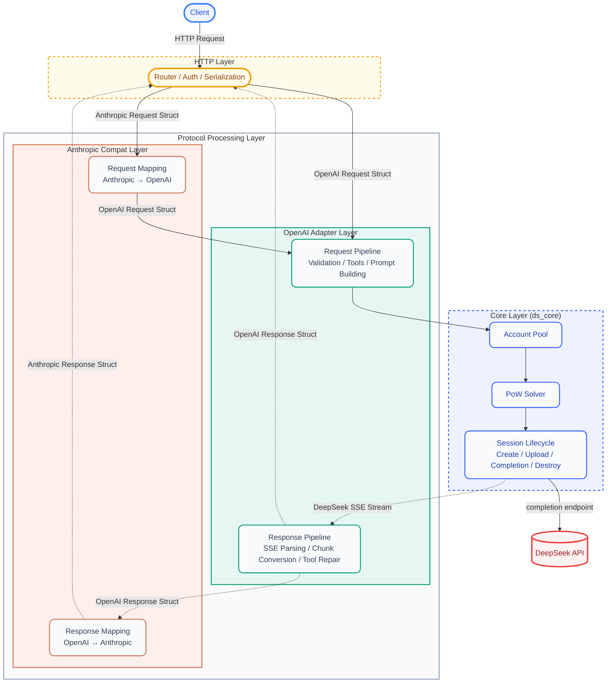
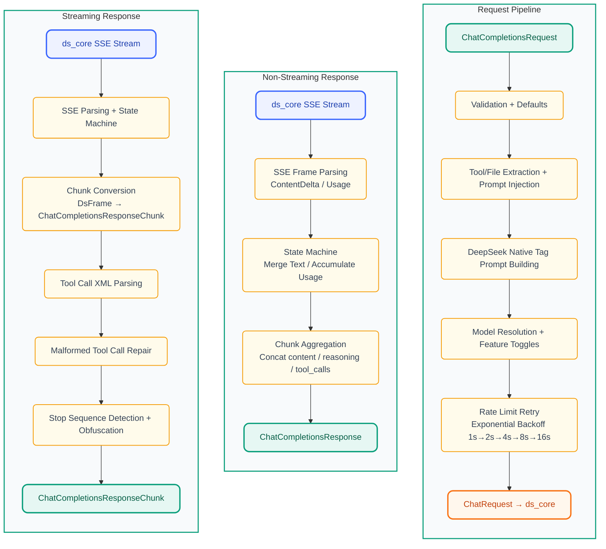
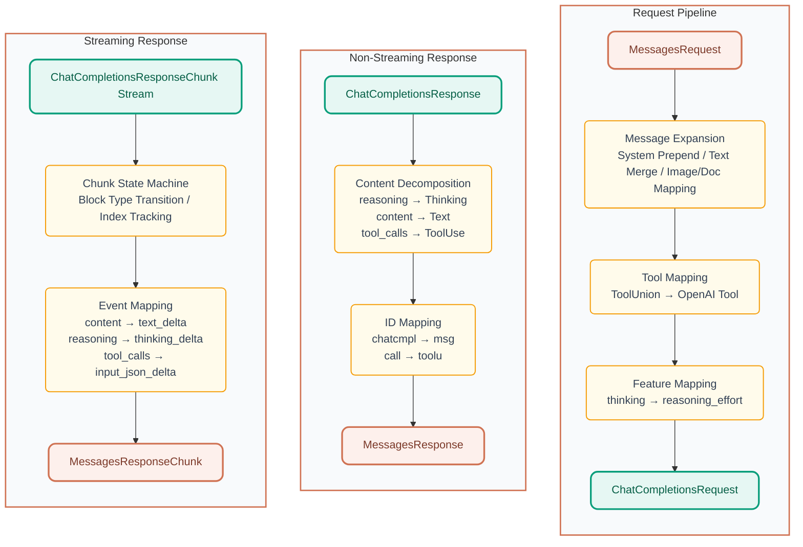

<p align="center">
  
</p>

<h1 align="center">DS-Free-API</h1>

<p align="center">
  <a href="LICENSE"></a>
  
  
  
</p>
<p align="center">
  
  
  
  
</p>

[中文](README.md)

A proxy that translates free DeepSeek web chat into standard OpenAI and Anthropic compatible APIs (supports chat completions and messages with streaming and tool calling).

## Highlights

- **Zero-cost API proxy**: Uses DeepSeek's free web interface — no API key required, compatible with OpenAI / Anthropic clients
- **Dual protocol**: OpenAI Chat Completions and Anthropic Messages API, drop-in replacement for mainstream clients
- **Tool calling ready**: Full OpenAI function calling with XML parsing + 3-layer self-repair pipeline (text → JSON → model fallback), covering 10+ malformed output patterns
- **File upload ready**: Supports OpenAI `file` / `image_url` content parts and Anthropic `image` / `document` content blocks — inline data URLs are automatically uploaded to the DeepSeek session;
  HTTP URLs trigger web search mode so the model can directly access the link
- **Web admin panel**: Built-in dashboard for account pool status, API key management, request logs, and config hot-reload
- **Model aliases**: Custom model ID mapping (e.g. `deepseek-v4-flash` → `deepseek-default`) for broader client compatibility
- **Rust implementation**: Single binary + single TOML config, native cross-platform performance (web panel embedded at compile time, zero extra files needed)
- **Multi-account pool**: Most-idle-first rotation (DashMap lock-free reads), horizontal scalability for concurrency

## Quick Start

Download the latest release for your platform from [releases](https://github.com/NIyueeE/ds-free-api/releases) and extract.

```
  .
  ├── ds-free-api          # Executable
  ├── LICENSE
  ├── README.md
  ├── README.en.md
  └── config.example.toml  # Example config
```

### Configuration

Copy `config.example.toml` to `config.toml` in the same directory as the executable, or use `./ds-free-api -c <config_path>` to specify a custom path.

### Run

```bash
# Default (requires config.toml in current directory)
./ds-free-api

# Custom config path
./ds-free-api -c /path/to/config.toml

# Debug logging
RUST_LOG=debug ./ds-free-api
```

Only required fields are shown below. One account equals one concurrent session.

> **Concurrency notes**: DeepSeek free API has rate limits per session (`Messages too frequent. Try again later.`). This project has built-in protection:
> - **Rate limit detection**: Listens for SSE `hint` events with `rate_limit` signal
> - **Exponential backoff**: Auto-retry on rate limit at 1s→2s→4s→8s→16s, up to 6 attempts
> - **Smart `stop_stream`**: Only called on client disconnect, skipped on normal completion
>
> **Recommended parallelism = accounts ÷ 2**. Tested 4 accounts + 2 concurrent at 100% pass rate across all stress scenarios. Single account + single concurrency also works with the retry mechanism.

```toml
[server]
host = "127.0.0.1"  # Change to 0.0.0.0 to expose to public network
port = 5317

# CORS allowed origins (default ["http://localhost:5317"])
# cors_origins = ["http://localhost:5317"]

# API keys and admin password are configured via the Web admin panel (http://127.0.0.1:5317/admin)
# First visit will guide you to set an admin password, then create/manage API keys in the panel

# Email and/or mobile. Mobile currently appears to support only +86.
[[accounts]]
email = "user1@example.com"
mobile = ""
area_code = ""
password = "pass1"
```

> **Tool call tag hallucination**: Built-in fuzzy matching (fullwidth `｜`(U+FF5C) ↔ `|`, `▁`(U+2581) ↔ `_`) handles most character-level variants automatically. If the model outputs a completely different tag format, add fallback tags in `config.toml` under `[deepseek]`:
> ```toml
> [deepseek]
> tool_call.extra_starts = ["<|tool_call_begin|>", "<tool_calls>", "<tool_call>"]
> tool_call.extra_ends = ["<|tool_call_end|>", "</tool_calls>", "</tool_call>"]
> ```

### Free Test Accounts

All passwords are `test12345`.

```
idyllic4202@wplacetools.com
espialeilani+grace@gmail.com
ar.r.o.g.anc.e.p.c.hz.xp@gmail.com
theobald2798+gladden@gmail.com
vj.zh.z.h.d.b.b.d.udhj.db@gmail.com
```

For more accounts, try temporary email services (some domains may not work) and register via the international version with a VPN.

Recommended temporary email: [tempmail.la](https://tempmail.la/) (some suffixes may not work, try multiple times)

## API Endpoints

### Public Endpoints

| Method | Path                         | Description                                      |
| ------ | ---------------------------- | ------------------------------------------------ |
| GET    | `/`                          | Health check                                     |
| GET    | `/health`                    | Health check (alias)                             |
| POST   | `/v1/chat/completions`       | Chat completions (streaming + tool calling)      |
| GET    | `/v1/models`                 | List models                                      |
| GET    | `/v1/models/{id}`            | Get model details                                |
| POST   | `/anthropic/v1/messages`     | Anthropic Messages API (streaming + tool calling)|
| GET    | `/anthropic/v1/models`       | List models (Anthropic format)                   |
| GET    | `/anthropic/v1/models/{id}`  | Get model details (Anthropic format)             |

### Admin Endpoints (JWT Auth Required)

| Method | Path                               | Description                  |
| ------ | ---------------------------------- | ---------------------------- |
| POST   | `/admin/api/setup`                 | Set admin password (first time) |
| POST   | `/admin/api/login`                 | Admin login                  |
| GET    | `/admin/api/status`                | Account pool status          |
| GET    | `/admin/api/stats`                 | Request statistics           |
| GET    | `/admin/api/models`                | Model list                   |
| GET    | `/admin/api/config`                | Current config (masked)      |
| GET    | `/admin/api/keys`                  | List API keys (masked)       |
| POST   | `/admin/api/keys`                  | Create API key               |
| DELETE | `/admin/api/keys/{key}`            | Delete API key               |
| POST   | `/admin/api/accounts`             | Add account dynamically      |
| DELETE | `/admin/api/accounts/{id}`         | Remove account dynamically   |
| POST   | `/admin/api/accounts/{id}/relogin` | Manual re-login for account  |
| POST   | `/admin/api/reload`                | Hot-reload config.toml accounts |
| GET    | `/admin/api/logs`                  | Request logs                 |
| GET    | `/admin/api/runtime-logs`          | Runtime logs                 |

## Model Mapping

`model_types` in `config.toml` (default: `["default", "expert"]`) maps to:

| OpenAI Model ID    | DeepSeek Mode  |
| ------------------ | -------------- |
| `deepseek-default` | Fast mode      |
| `deepseek-expert`  | Expert mode    |

The Anthropic compatibility layer uses the same model IDs via `/anthropic/v1/messages`.

Default aliases (customizable via `[deepseek.model_aliases]`):

| Alias Model ID       | Maps to             |
| -------------------- | ------------------- |
| `deepseek-v4-flash`  | `deepseek-default`  |
| `deepseek-v4-pro`    | `deepseek-expert`   |

### Feature Toggles

- **Reasoning**: Enabled by default. Set `"reasoning_effort": "none"` in the request body to disable.
- **Web search**: Enabled by default (DeepSeek backend injects stronger system prompts in search mode, improving tool call compliance). Set `"web_search_options": {"search_context_size": "none"}` to disable.
- **File upload**: Supports inline data URLs (automatically uploaded to the DeepSeek session) and HTTP URLs (triggers web search mode):

  **OpenAI:**
  ```json
  {"type": "file", "file": {"file_data": "data:text/plain;base64,...", "filename": "doc.txt"}}
  {"type": "image_url", "image_url": {"url": "data:image/png;base64,..."}}
  {"type": "image_url", "image_url": {"url": "https://example.com/img.jpg"}}
  ```

  **Anthropic:**
  ```json
  {"type": "image", "source": {"type": "base64", "media_type": "image/png", "data": "..."}}
  {"type": "document", "source": {"type": "base64", "media_type": "text/plain", "data": "..."}}
  {"type": "image", "source": {"type": "url", "url": "https://example.com/img.jpg"}}
  ```

## Web Admin Panel

Visit `http://127.0.0.1:5317/admin` after starting the server:

- **Dashboard**: Request statistics and account pool overview
- **Accounts**: View/add/remove accounts, manual re-login for Error-state accounts
- **API Keys**: Create/delete API keys, masked display
- **Models**: Available model list and details
- **Config**: Current runtime config (masked)
- **Logs**: Recent request logs and runtime logs

First visit guides you to set an admin password (bcrypt hashed), login issues a JWT (24h validity), and password reset revokes old tokens.

## Security

- **Admin panel**: JWT authentication + bcrypt password hashing + login failure rate limiting (5 failures → 5 min lockout)
- **API access**: API keys created via admin panel (HashSet O(1) lookup)
- **CORS**: Configurable allowed origin list, default `http://localhost:5317` only
- **Sensitive data**: Account IDs masked in response headers, request bodies not logged, persisted files permission 0600

## Development

Requires Rust 1.95.0+ (see `rust-toolchain.toml`) and Node.js 18+ (for web panel development).

### Build from Source

```bash
# 1. Build web frontend (embedded into binary at compile time, must build before release)
cd web && npm install && npm run build && cd ..

# 2. Build release binary (web panel embedded via rust-embed)
cargo build --release

# 3. Run
./target/release/ds-free-api
```

> **Dev mode**: When `web/dist/` directory exists, the server reads from the filesystem first (supports frontend hot-reload);
> otherwise it falls back to compile-time embedded assets. During development, run `npm run dev` (Vite HMR) alongside `just serve`.

### Docker Deployment

```bash
# Using docker-compose (recommended)
docker compose up -d

# Or build manually
docker build -t ds-free-api .
docker run -d \
  -p 5317:5317 \
  -v ./config.toml:/app/config.toml:ro \
  -v ds-data:/app/data \
  -e RUST_LOG=info \
  ds-free-api
```

The Docker image uses a three-stage build: Node builds the web frontend → Rust compiles with embedded web assets → minimal runtime image (`debian:bookworm-slim`). The final image contains only the single binary + config file.

Persistent data (`admin.json`, `api_keys.json`, `stats.json`) is stored in the `/app/data` volume.

> **Prompt Injection Strategy**: This project converts OpenAI message formats into DeepSeek native tags (`<｜User｜>` / `<｜Assistant｜>` / `<｜Tool｜〉`, etc.) and embeds a `<think>` block to guide the model's reasoning chain, injecting tool definitions and formatting instructions. For detailed research and implementation, see [`docs/deepseek-prompt-injection.md`](docs/deepseek-prompt-injection.md). If you have better ideas or findings, feel free to open an issue or PR.

```bash
# One-pass check (check + clippy + fmt + audit + unused deps)
just check

# Run tests
cargo test

# Run HTTP server
just serve

# Unified protocol debug CLI (chat/compare/concurrent modes)
just adapter-cli

# e2e tests (requires server running on port 5317)
just e2e-basic    # Basic features (dual endpoints)
just e2e-repair   # Tool call repair tests
just e2e-stress   # Multi-iteration stress test

# Start server with e2e config
just e2e-serve
```

### Architecture Overview



### Data Pipelines

#### OpenAI (chat_completions) Pipeline:



#### Anthropic (messages) Pipeline:



### e2e Tests

`py-e2e-tests/` is a JSON scenario-driven end-to-end test framework (no pytest dependency). Three levels:

| Level      | Command           | Coverage                                                |
| ---------- | ----------------- | ------------------------------------------------------- |
| **Basic**  | `just e2e-basic`  | Core features (OpenAI + Anthropic endpoints), safe concurrency |
| **Repair** | `just e2e-repair` | Malformed tool call repair tests (OpenAI endpoint), safe concurrency |
| **Stress** | `just e2e-stress` | All scenarios × 3 iterations, safe concurrency + 1 concurrency |

Scenarios are organized by type in `scenarios/`:

```
py-e2e-tests/
├── scenarios/
│   ├── basic/
│   │   ├── openai/         # 10 basic scenarios (chat, reasoning, streaming, tool calls, file upload, image upload, HTTP link, etc.)
│   │   └── anthropic/      # 6 basic scenarios (chat, reasoning, tool calls, document upload, image upload, HTTP link)
│   └── repair/             # 10 malformed tool call scenarios
├── runner.py               # Single-run entry point
├── stress_runner.py        # Multi-iteration stress test entry point
└── config.toml             # e2e-specific server config
```

Each scenario is a standalone JSON file with request parameters and validation rules:

```json
{
  "name": "Scenario Name",
  "endpoint": "openai|anthropic",
  "category": "basic|repair",
  "models": ["deepseek-default", "deepseek-expert"],
  "messages": [{"role": "user", "content": "..."}],
  "tools": [...],
  "tool_choice": "auto",
  "request": {"stream": false},
  "checks": {
    "has_tool_calls": true,
    "tool_names": ["get_weather"],
    "finish_reason": "tool_calls",
    "no_error": true
  }
}
```

### e2e CLI Options

**`just e2e-basic` and `just e2e-repair` (single run):**

| Option | Description |
|--------|-------------|
| `scenario_dir` | Scenario directory, e.g. `scenarios/basic` or `scenarios/repair` |
| `--endpoint` | Filter by endpoint: `openai` / `anthropic` |
| `--model` | Filter by model: `deepseek-default` / `deepseek-expert` |
| `--filter` | Filter by keyword(s) in scenario name (space-separated, e.g. `--filter file image`) |
| `--parallel` | Concurrency, default `accounts ÷ 2` |
| `--show-output` | Show model response summaries, tool calls, and finish reasons |
| `--report` | Output JSON report path |

**`just e2e-stress` (stress test):**

| Option | Description |
|--------|-------------|
| `--iterations` | Iterations per scenario, default 3 |
| `--models` | Filter by model list |
| `--filter` | Filter by keyword(s) in scenario name (space-separated) |
| `--parallel` | Concurrency, default `accounts ÷ 2 + 1` |
| `--show-output` | Show model output |
| `--report` | Output JSON report path |

Examples:

```bash
# Quick verification of file/image upload scenarios
just e2e-basic --filter file image --show-output

# OpenAI endpoint only, expert model
just e2e-basic --endpoint openai --model deepseek-expert

# Sequential debugging
just e2e-basic --endpoint openai --parallel 1 --show-output

# Stress test: tool repair scenarios × 5 iterations
just e2e-stress --filter repair --iterations 5

# Output JSON report
just e2e-basic --report result.json
```

**Recommended**: Run e2e tests before submitting a PR.

## License

[Apache License 2.0](LICENSE)

[DeepSeek official API](https://platform.deepseek.com/top_up) is very affordable — please support the official service if you can.

This project was created to experience the latest models from DeepSeek's web grayscale testing.

**Commercial use is strictly prohibited** to avoid burdening official servers. Use at your own risk.
