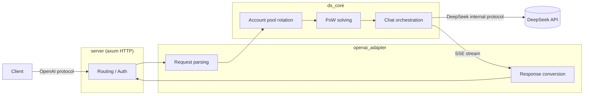

# DS-Free-API

[](LICENSE)


[中文](README.md)

Reverse proxy and adapter for free DeepSeek web chat endpoints to standard OpenAI-compatible API protocol (currently supports openai_chat_completions, including streaming and tool calls).

Cross-platform native Rust binary + single TOML config file.

## Quick Start

Download the release for your platform from [releases](https://github.com/NIyueeE/ds-free-api/releases) and extract.

```
  .
  ├── ds-free-api          # executable
  ├── LICENSE
  ├── README.md
  ├── README.en.md
  └── config.example.toml  # config template
```

### Configuration

Copy `config.example.toml` to `config.toml` in the same directory as the executable, or use `./ds-free-api -c <config_path>` to specify a config path.

### Run

```bash
# Run directly (requires config.toml in the same directory)
./ds-free-api

# Specify config path
./ds-free-api -c /path/to/config.toml

# Debug mode
RUST_LOG=debug ./ds-free-api
```

Required fields only. One account = one concurrency slot (seems max 2 concurrent).

```toml
[server]
host = "127.0.0.1"
port = 5317

# API access tokens, leave empty to disable auth
# [[server.api_tokens]]
# token = "sk-your-token"
# description = "dev test"

# Fill email or mobile (pick one or both). Mobile seems to only support +86 area.
[[accounts]]
email = "user1@example.com"
mobile = ""
area_code = ""
password = "pass1"
```

Here's a free test account — please don't send sensitive info through it (the program deletes sessions on cleanup, but leftovers may persist).

```text
rivigol378@tatefarm.com
test12345
```

If you want multiple accounts for concurrency, look into temporary email services (some may not work) and use a VPN to register on the international version.

Recommended temp-mail site: [temp-mail.org](https://temp-mail.org/en/10minutemail)

## API Endpoints

| Method | Path | Description |
|--------|------|-------------|
| GET | `/` | Health check |
| POST | `/v1/chat/completions` | Chat completions (streaming and tool calls supported) |
| GET | `/v1/models` | List models |
| GET | `/v1/models/{id}` | Get model |

## Model Mapping

`model_types` in `config.toml` (defaults to `["default", "expert"]`) maps automatically:

| OpenAI Model ID | DeepSeek Type |
|-----------------|---------------|
| `deepseek-default` | Default mode |
| `deepseek-expert` | Expert mode |

### Capability Toggles

- **Reasoning**: Enabled by default. To disable, add `"reasoning_effort": "none"` to the request body.
- **Web search**: Disabled by default. To enable, add `"web_search_options": {"search_context_size": "high"}`.
- **Tool calls**: Pass standard OpenAI `tools` and `tool_choice` fields. When the model decides to call a tool, the returned `finish_reason` will be `tool_calls`.

## Development

Requires Rust 1.94.1+ (see `rust-toolchain.toml`).

```bash
# One-pass check (check + clippy + fmt + audit + unused deps)
just check

# Run tests
cargo test

# Run HTTP server
just serve

# CLI examples
just ds-core-cli
just openai-adapter-cli

# Python e2e tests (requires server running on port 5317)
just e2e

# Start server with e2e test config
just e2e-serve
```

Architecture overview:



Data pipelines:

- **Request**: `JSON body` → `normalize` validation/defaults → `tools` extraction → `prompt` ChatML build → `resolver` model mapping → `ChatRequest`
- **Response**: `DeepSeek SSE bytes` → `sse_parser` → `state` patch state machine → `converter` format conversion → `tool_parser` XML parsing → `StopStream` truncation → `OpenAI SSE bytes`

## License

[Apache License 2.0](LICENSE)

DeepSeek's official API is very affordable. Please support the official service.

This project was created to experiment with the latest models in DeepSeek's web A/B testing.

**Commercial use is strictly prohibited** to avoid putting pressure on official servers. Use at your own risk.
