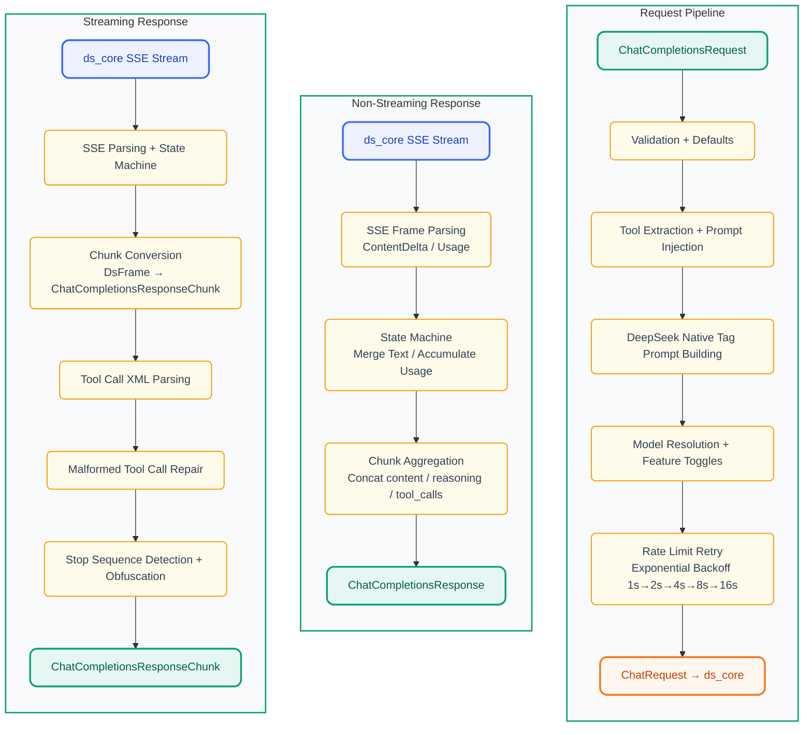
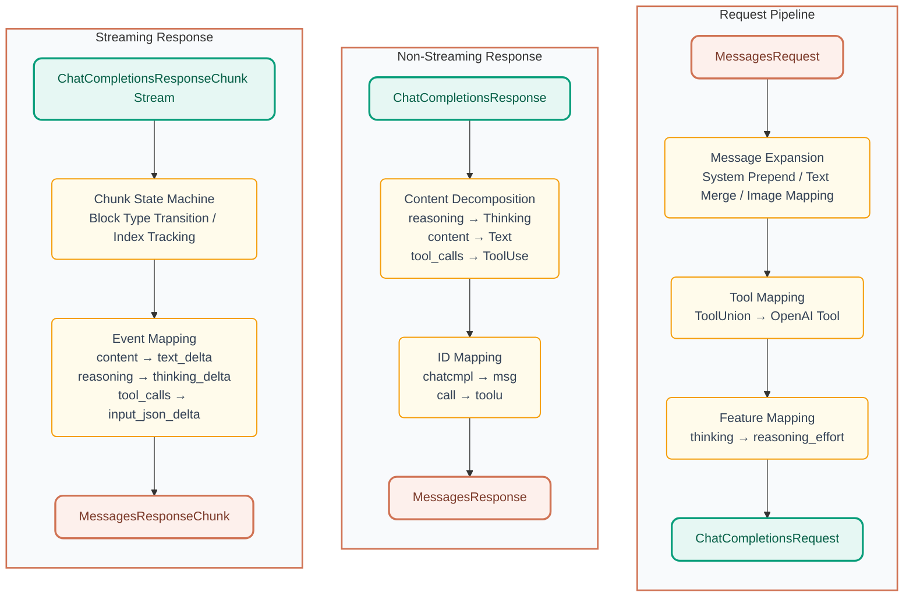

<p align="center">
  
</p>

<h1 align="center">DS-Free-API</h1>

<p align="center">
  <a href="LICENSE"></a>
  
  
  
</p>
<p align="center">
  
  
  
  
</p>

[中文](README.md)

A proxy that translates free DeepSeek web chat into standard OpenAI and Anthropic compatible APIs (supports chat completions and messages with streaming and tool calling).

## Highlights

- **Zero-cost API proxy**: Uses DeepSeek's free web interface — no API key required, compatible with OpenAI / Anthropic clients
- **Dual protocol**: OpenAI Chat Completions and Anthropic Messages API, drop-in replacement for mainstream clients
- **Tool calling ready**: Full OpenAI function calling with XML parsing + 3-layer self-repair pipeline (text → JSON → model fallback), covering 10+ malformed output patterns
- **Rust implementation**: Single binary + single TOML config, native cross-platform performance
- **Multi-account pool**: Most-idle-first rotation, horizontal scalability for concurrency

## Quick Start

Download the latest release for your platform from [releases](https://github.com/NIyueeE/ds-free-api/releases) and extract.

```
  .
  ├── ds-free-api          # Executable
  ├── LICENSE
  ├── README.md
  ├── README.en.md
  └── config.example.toml  # Example config
```

### Configuration

Copy `config.example.toml` to `config.toml` in the same directory as the executable, or use `./ds-free-api -c <config_path>` to specify a custom path.

### Run

```bash
# Default (requires config.toml in current directory)
./ds-free-api

# Custom config path
./ds-free-api -c /path/to/config.toml

# Debug logging
RUST_LOG=debug ./ds-free-api
```

Only required fields are shown below. One account equals one concurrent session.

> **Concurrency notes**: DeepSeek free API has rate limits per session (`Messages too frequent. Try again later.`). This project has built-in protection:
> - **Rate limit detection**: Listens for SSE `hint` events with `rate_limit` signal
> - **Exponential backoff**: Auto-retry on rate limit at 1s→2s→4s→8s→16s, up to 6 attempts
> - **Smart `stop_stream`**: Only called on client disconnect, skipped on normal completion
>
> **Recommended parallelism = accounts ÷ 2**. Tested 4 accounts + 2 concurrent at 100% pass rate across all stress scenarios. Single account + single concurrency also works with the retry mechanism.

```toml
[server]
host = "127.0.0.1"
port = 5317

# API tokens for authentication, leave empty to disable
# [[server.api_tokens]]
# token = "sk-your-token"
# description = "Development"

# Email and/or mobile. Mobile currently appears to support only +86.
[[accounts]]
email = "user1@example.com"
mobile = ""
area_code = ""
password = "pass1"
```

### Free Test Accounts

```
rivigol378@tatefarm.com
test12345

counterfeit1341@wplacetools.com
test12345

idyllic4202@wplacetools.com
test12345

slowly1285@wplacetools.com
test12345
```

For more accounts, try temporary email services (some domains may not work) and register via the international version with a VPN.

Recommended temporary email: [tempmail.la](https://tempmail.la/) (some suffixes may not work, try multiple times)

## API Endpoints

| Method | Path                         | Description                                      |
| ------ | ---------------------------- | ------------------------------------------------ |
| GET    | `/`                          | Health check                                     |
| POST   | `/v1/chat/completions`       | Chat completions (streaming + tool calling)      |
| GET    | `/v1/models`                 | List models                                      |
| GET    | `/v1/models/{id}`            | Get model details                                |
| POST   | `/anthropic/v1/messages`     | Anthropic Messages API (streaming + tool calling)|
| GET    | `/anthropic/v1/models`       | List models (Anthropic format)                   |
| GET    | `/anthropic/v1/models/{id}`  | Get model details (Anthropic format)             |

## Model Mapping

`model_types` in `config.toml` (default: `["default", "expert"]`) maps to:

| OpenAI Model ID    | DeepSeek Mode  |
| ------------------ | -------------- |
| `deepseek-default` | Fast mode      |
| `deepseek-expert`  | Expert mode    |

The Anthropic compatibility layer uses the same model IDs via `/anthropic/v1/messages`.

### Feature Toggles

- **Reasoning**: Enabled by default. Set `"reasoning_effort": "none"` in the request body to disable.
- **Web search**: Disabled by default. Set `"web_search_options": {"search_context_size": "high"}` to enable.

## Development

Requires Rust 1.95.0+ (see `rust-toolchain.toml`).

> **Prompt Injection Strategy**: This project converts OpenAI message formats into DeepSeek native tags (`<｜User｜>` / `<｜Assistant｜>` / `<｜Tool｜〉`, etc.) and embeds a `<think>` block to guide the model's reasoning chain, injecting tool definitions and formatting instructions. For detailed research and implementation, see [`docs/deepseek-prompt-injection.md`](docs/deepseek-prompt-injection.md). If you have better ideas or findings, feel free to open an issue or PR.

```bash
# One-pass check (check + clippy + fmt + audit + unused deps)
just check

# Run tests
cargo test

# Run HTTP server
just serve

# Unified protocol debug CLI (chat/compare/concurrent modes)
just adapter-cli

# e2e tests (requires server running on port 5317)
just e2e-basic    # Basic features (dual endpoints)
just e2e-repair   # Tool call repair tests
just e2e-stress   # Multi-iteration stress test

# Start server with e2e config
just e2e-serve
```

### Architecture Overview


### Data Pipelines

#### OpenAI (chat_completions) Pipeline:



#### Anthropic (messages) Pipeline:



### e2e Tests

`py-e2e-tests/` is a JSON scenario-driven end-to-end test framework (no pytest dependency). Three levels:

| Level      | Command           | Coverage                                                |
| ---------- | ----------------- | ------------------------------------------------------- |
| **Basic**  | `just e2e-basic`  | Core features (OpenAI + Anthropic endpoints), safe concurrency |
| **Repair** | `just e2e-repair` | Malformed tool call repair tests (OpenAI endpoint), safe concurrency |
| **Stress** | `just e2e-stress` | All scenarios × 3 iterations, safe concurrency + 1 concurrency |

Scenarios are organized by type in `scenarios/`:

```
py-e2e-tests/
├── scenarios/
│   ├── basic/
│   │   ├── openai/         # 7 basic scenarios (chat, reasoning, streaming, tool calls, etc.)
│   │   └── anthropic/      # 3 basic scenarios (chat, reasoning, tool calls)
│   └── repair/             # 10 malformed tool call scenarios
├── runner.py               # Single-run entry point
├── stress_runner.py        # Multi-iteration stress test entry point
└── config.toml             # e2e-specific server config
```

Each scenario is a standalone JSON file with request parameters and validation rules:

```json
{
  "name": "Scenario Name",
  "endpoint": "openai|anthropic",
  "category": "basic|repair",
  "models": ["deepseek-default", "deepseek-expert"],
  "messages": [{"role": "user", "content": "..."}],
  "tools": [...],
  "tool_choice": "auto",
  "request": {"stream": false},
  "checks": {
    "has_tool_calls": true,
    "tool_names": ["get_weather"],
    "finish_reason": "tool_calls",
    "no_error": true
  }
}
```

**Recommended**: Run e2e tests before submitting a PR.

## License

[Apache License 2.0](LICENSE)

[DeepSeek official API](https://platform.deepseek.com/top_up) is very affordable — please support the official service if you can.

This project was created to experience the latest models from DeepSeek's web grayscale testing.

**Commercial use is strictly prohibited** to avoid burdening official servers. Use at your own risk.
