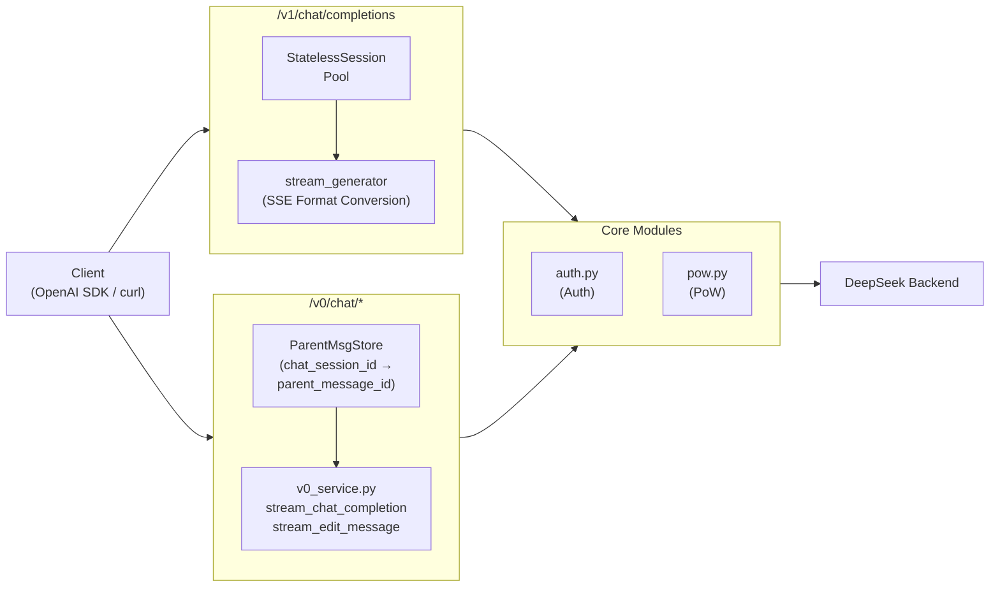

# DeepSeek Web API

[](LICENSE)


[English](./README.md) | [中文](./README.中文.md)

Inspired by [deepseek2api](https://github.com/iidamie/deepseek2api). Transparent proxy for DeepSeek Chat API with automatic authentication and PoW calculation.

## Features

- **Automatic Authentication**: Server manages account credentials, no client-side auth required (token obtained on first API call)
- **PoW (Proof of Work)**: Automatic PoW challenge solving for chat and file upload
- **SSE Streaming**: Pass-through SSE responses from DeepSeek
- **OpenAI Compatible API**: `/v1/chat/completions` endpoint with full tool calling support

## Quick Start

**New here?** Follow the [beginner-friendly installation guide](./docs/INSTALL.md) for step-by-step instructions (only `uv` required).

```bash
# Configure account
cp config.toml.example config.toml
# Edit config.toml with your DeepSeek credentials

# Run server
uv run python main.py
```

**Note**: Only single-user mode is supported to prevent excessive load on DeepSeek's servers. ~Multi-user requests will not be implemented.~

## Configuration

`config.toml` is required before running:

```toml
[server]
host = "127.0.0.1"                  # Recommended: keep loopback-only
port = 5001
reload = true
cors_origins = ["*"]                 # Recommended: replace with explicit origins for browser clients
cors_allow_credentials = false
cors_allow_methods = ["*"]
cors_allow_headers = ["*"]
pool_size = 10                       # Max concurrent DeepSeek sessions; requests wait when at capacity, 503 on timeout
pool_acquire_timeout = 30.0           # Seconds to wait for a free session before returning 503

[auth]
tokens = []                          # Configure one or more tokens to enable auth
# Example: tokens = ["sk-prod-xxx", "sk-backup-yyy"]

[account]
email = "your_email@example.com"   # Email login (priority)
mobile = ""                        # Phone login (used when email is empty)
area_code = "86"                   # Phone area code, e.g. "86"
password = "your_password"
token = ""                         # Optional, system will auto-manage (saved after first use)
```

**Docker / Env var overrides**:
- `CONFIG_PATH`: Config file path (env: `CONFIG_PATH`, default `config.toml`)

**WASM module**: Configured via `[wasm]` section in `config.toml`:
- `url`: Download URL (auto-downloaded on first run if not present)
- `path`: Local save path (default `core/deepseek.wasm`)

**Security**:
- `[auth].tokens` is a simple string array. Non-empty array means auth is required; empty array means anonymous access (only safe for loopback).
- If at least one token is configured, all `/v0/*` and `/v1/*` endpoints require either `Authorization: Bearer <token>` or `X-API-Key: <token>`.
- **Fail-fast protection**: If `[server].host` is non-loopback (e.g., `0.0.0.0`) and `[auth].tokens` is empty, the server will refuse to start.
- CORS is configurable via `[server].cors_*`. The default remains permissive for compatibility, but you should narrow `cors_origins` before exposing browser clients.
- You should still run the service on `127.0.0.1` unless you intentionally expose it.

## Models

Available models via `/v1/models`:

| Model | Description |
|-------|-------------|
| `deepseek-web-chat` | Standard chat model, thinking disabled |
| `deepseek-web-reasoner` | Reasoning model with chain-of-thought thinking |

**Note**: Internal search functionality is disabled by default (no web search).

## Usage Example

[AstrBot](https://github.com/AstrBotDevs/AstrBot) integration with streaming reasoning and tool calls:


## API Endpoints

| Endpoint | Method | Description |
|----------|--------|-------------|
| `/v1/chat/completions` | POST | OpenAI-compatible chat completions with tool support |
| `/v0/chat/completion` | POST | Send chat message, streaming SSE |
| `/v0/chat/create_session` | POST | Create new session |
| `/v0/chat/delete` | POST | Delete session |
| `/v0/chat/history_messages` | GET | Get chat history |
| `/v0/chat/upload_file` | POST | Upload file |
| `/v0/chat/fetch_files` | GET | Query file status |
| `/v0/chat/message` | POST | Edit message |

### Endpoint Details

#### POST /v1/chat/completions
OpenAI-compatible chat completions endpoint with full tool calling support and streaming responses. Fully compatible with OpenAI SDK.

**Features**:
- Accepts OpenAI-style `messages` array
- Supports `tool_calls` and multi-turn tool conversations
- Streaming/non-streaming responses
- Internally uses `edit_message` API for stateless sessions

**Supported OpenAI Parameters**:

| Parameter | Type | Description |
|-----------|------|-------------|
| `model` | string | Model ID, defaults to `deepseek-web-chat` |
| `messages` | array | OpenAI-style message array |
| `stream` | bool | Streaming response, default `false` |
| `tools` | array | Tool definitions for function calling |
| `tool_choice` | string \| object | Controls which tools the model may call. Values: `"auto"` (default), `"none"` (disable tools), `"required"` (must call at least one tool), or `{"type": "function", "function": {"name": "..."}}` (call a specific tool). This parameter is proxy-layer only and not forwarded to DeepSeek. |
| `parallel_tool_calls` | bool | Whether to allow parallel tool calls. Default `true`. When `false`, the model is instructed to call only one tool at a time. This parameter is proxy-layer only and not forwarded to DeepSeek. |
| `extra_body` | dict | DeepSeek-specific parameters (see below) |

> **Note on `tools`**: Each tool supports a `strict` property inside `function` (e.g., `{"type": "function", "function": {"name": "...", "strict": true}}`). When `strict: true`, the model is instructed to strictly follow the JSON Schema — do not add undefined fields, do not omit required fields, do not use values outside enum lists. Both natural language description and JSON Schema block are included in the prompt for maximum constraint fidelity.

**DeepSeek-specific parameters via `extra_body`**:

| Parameter | Type | Default | Description |
|-----------|------|---------|-------------|
| `search_enabled` | bool | `false` | Enable DeepSeek web backend's search feature |
| `thinking_enabled` | bool | `true` for reasoner model, `false` for chat | Enable thinking. For `deepseek-web-chat`: enables thinking output; for `deepseek-web-reasoner`: set to `false` to disable thinking |

Example with OpenAI SDK:
```python
from openai import OpenAI

client = OpenAI(api_key="your-token", base_url="http://localhost:5001/v1")
response = client.chat.completions.create(
    model="deepseek-web-chat",
    messages=[{"role": "user", "content": "Hello"}],
    extra_body={
        "search_enabled": True,      # Enable DeepSeek web search
        "thinking_enabled": True,    # Enable thinking output (for chat model)
    }
)
```

### Endpoint Details

#### POST /v0/chat/completion
**External**: Accepts `prompt`, optional `chat_session_id`, optional `ref_file_ids`, returns SSE stream.

**Internal**:
- No `chat_session_id` → Creates session via `POST /api/v0/chat_session/create`, stores locally, returns `X-Chat-Session-Id` header
- Has `chat_session_id` → Looks up `parent_message_id` from local store, appends to request
- Adds `Authorization`, `x-ds-pow-response` headers, proxies to DeepSeek
- Parses SSE to extract `response_message_id`, updates local session store

#### POST /v0/chat/create_session
**External**: Accepts `{"agent": "chat"}`, returns DeepSeek session data.

**Internal**:
- Proxies to `POST /api/v0/chat_session/create`
- Extracts `chat_session_id` from response, stores in local session map
- Returns DeepSeek response with explicit `chat_session_id` field at top level

#### POST /v0/chat/delete
**External**: Accepts `{"chat_session_id": "..."}`, returns DeepSeek response.

**Internal**:
- Removes session from local session store
- Proxies to `POST /api/v0/chat_session/delete`

#### GET /v0/chat/history_messages
**External**: Query params `chat_session_id`, `offset`, `limit`, returns message history.

**Internal**:
- Adds `Authorization` header, proxies to `GET /api/v0/chat/history_messages`

#### POST /v0/chat/upload_file
**External**: Multipart form with `file` field, returns file ID with `PENDING` status.

**Internal**:
- Reads file from form, calculates PoW for `/api/v0/file/upload_file` endpoint
- Adds `Authorization`, `x-ds-pow-response`, `x-file-size` headers
- Proxies to `POST /api/v0/file/upload_file`

#### GET /v0/chat/fetch_files
**External**: Query param `file_ids` (comma-separated), returns file status.

**Internal**:
- Adds `Authorization` header, proxies to `GET /api/v0/file/fetch_files`
- File status: `PENDING` = parsing, `SUCCESS` = done, `FAILED` = error

See [v0_API](./docs/v0_API.md) for detailed documentation.

## Implementation Notes

### OpenAI Adapter (`/v1/chat/completions`)
Implements stateless sessions via `edit_message` API:
- Client sends complete `messages` array, adapter injects conversation history into prompt
- Uses `message_id=1` with `edit_message` to always edit the latest user message
- Model always thinks it's the "first conversation", avoiding session state accumulation
- Supports `deepseek-web-reasoner` model's thinking content

**Session Pool**:
- Maintains a bounded pool of DeepSeek sessions (`pool_size`, default 10)
- When all sessions are busy, new requests wait up to `pool_acquire_timeout` seconds (default 30s) before returning HTTP 503
- Idle sessions are cleaned up automatically every `max_idle_seconds/2` (default 150s)
- Hard cap prevents flooding DeepSeek with unbounded concurrent session creations

**Rate Limit Handling**:
- `proxy_to_deepseek_stream` detects HTTP 429 and 5xx responses before yielding any bytes
- On rate limit, retries up to 3 times with exponential backoff (5s, 10s, 20s), respecting `Retry-After` header
- Each retry fetches a fresh PoW challenge (challenges expire)
- If all retries fail: streaming returns an SSE error chunk; non-streaming returns HTTP 503
- Rate limit errors do NOT trigger session pool retry (account-wide limit, switching sessions won't help)

**Anti-Hallucination Mechanism**:
When the model outputs `[TOOL🛠️]...[/TOOL🛠️]`:
1. The adapter extracts and parses the tool call JSON
2. Sends the `tool_calls` chunk and `finish_reason=tool_calls` to the client
3. Sends `data: [DONE]\n\n` to signal stream end
4. Continues consuming the remaining DeepSeek stream (discarding data) to properly close the connection

## TODO

- [x] Simple wrapper for deepseek_web_chat API
- [x] Implement openai_chat_completions protocol adapter
- [x] Streaming tool call extraction for openai adapter
- [x] Session pool hard cap to prevent flooding DeepSeek with concurrent session creations
- [x] Rate limit detection (HTTP 429/5xx) with exponential backoff retry in streaming path
- [ ] Implement claude_message protocol adapter via [litellm](https://github.com/BerriAI/litellm) (convert OpenAI protocol to Claude protocol)
- [ ] Implement multi-user account load balancing to prevent DeepSeek rate limiting with concurrent requests

## Architecture



## Disclaimer

DeepSeek's official API is very affordable. Please support the official service.

This project was created to experience the latest grayscale-tested models on the official web version.

**Commercial use is strictly prohibited** to avoid putting pressure on DeepSeek's servers. Use at your own risk.
