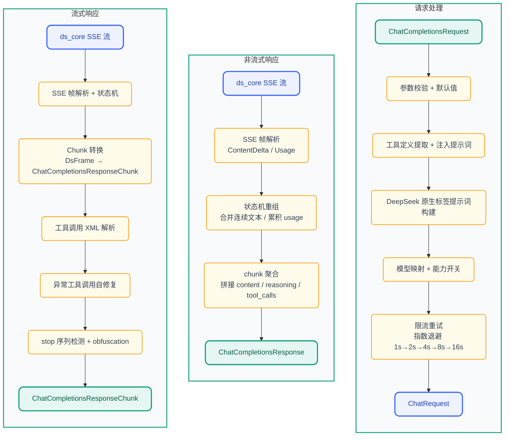
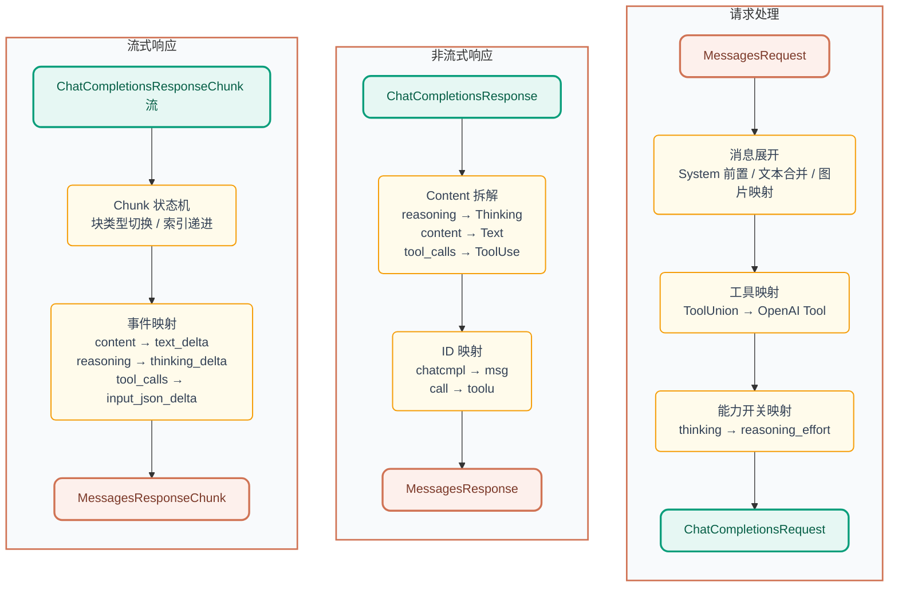

<p align="center">
  
</p>

<h1 align="center">DS-Free-API</h1>

<p align="center">
  <a href="LICENSE"></a>
  
  
  
</p>
<p align="center">
  
  
  
  
</p>

[English](README.en.md)

将免费的 DeepSeek 网页端对话反代并适配转换为标准的 OpenAI 与 Anthropic 兼容 API 协议（目前支持 chat completions 和 messages，包括流式返回与工具调用）。

## 项目亮点

- **零成本 API 代理**：使用 DeepSeek 免费网页端，无需官方 API Key，即可获得 OpenAI / Anthropic 兼容接口
- **双协议支持**：同时兼容 OpenAI Chat Completions 与 Anthropic Messages API，主流客户端即插即用
- **工具调用就绪**：OpenAI function calling 完整实现，工具解析 + 三层自修复管道（文本修复 → JSON 修复 → 模型兜底），覆盖 10+ 异常格式
- **Rust 实现**：单可执行文件 + 单 TOML 配置，跨平台原生高性能
- **多账号池**：空闲最久优先轮转，支持水平扩展并发

## 快速开始

去 [releases](https://github.com/NIyueeE/ds-free-api/releases) 下载对应平台后解压即可。

```
  .
  ├── ds-free-api          # 可执行文件
  ├── LICENSE
  ├── README.md
  ├── README.en.md
  └── config.example.toml  # 配置示例
```

### 配置

复制 `config.example.toml` 为 `config.toml`，和可执行文件保持在同一个路径下，或者使用 `./ds-free-api -c <config_path>`  指定配置路径。

### 运行

```bash
# 直接运行 (同目录下需要 config.toml)
./ds-free-api

# 指定配置路径
./ds-free-api -c /path/to/config.toml

# 调试模式
RUST_LOG=debug ./ds-free-api
```

这里只展示必填项。一个账号对应一个并发量。

> **并发说明**：DeepSeek 免费 API 对每个 session 有速率限制（`Messages too frequent. Try again later.`），单账号在频繁请求时会触发限流。本项目内置以下机制保障稳定：
> - **限流自动检测**：监听 SSE `hint` 事件中的 `rate_limit` 信号，快速识别限流
> - **指数退避重试**：检测到限流后自动重试，间隔为 1s→2s→4s→8s→16s，最多 6 次
> - **`stop_stream` 智能触发**：仅在客户端主动断连时调用，正常完成时跳过，避免请求冲突
>
> **推荐并行数 = 账号数 ÷ 2**。实测 4 账号 + 2 并发可 100% 通过全部压测场景。单账号 + 单并发在上述重试机制下也可跑通。

```toml
[server]
host = "127.0.0.1"
port = 5317

# API 访问令牌，留空则不鉴权
# [[server.api_tokens]]
# token = "sk-your-token"
# description = "开发测试"

# 邮箱和手机号二选一或都填，手机号目前好像只支持 +86
[[accounts]]
email = "user1@example.com"
mobile = ""
area_code = ""
password = "pass1"
```

这里分享几个免费的测试账号，不要发敏感信息（虽然程序每次会收尾删除会话，但是可能会遗留）。

```text
rivigol378@tatefarm.com
test12345

counterfeit1341@wplacetools.com
test12345

idyllic4202@wplacetools.com
test12345

slowly1285@wplacetools.com
test12345
```

想要自己多整几个账号并发的话，可以研究一下临时邮箱（有些可能不行），然后加魔法在国际版中多注册几个账号。

推荐临时邮箱网站：[tempmail.la](https://tempmail.la/) (有些后缀可能不行, 建议多尝试几次)

## API 端点

| 方法 | 路径                        | 说明                                         |
| ---- | --------------------------- | -------------------------------------------- |
| GET  | `/`                         | 健康检查                                     |
| POST | `/v1/chat/completions`      | 聊天补全（支持流式与工具调用）               |
| GET  | `/v1/models`                | 模型列表                                     |
| GET  | `/v1/models/{id}`           | 模型详情                                     |
| POST | `/anthropic/v1/messages`    | Anthropic Messages API（支持流式与工具调用） |
| GET  | `/anthropic/v1/models`      | 模型列表（Anthropic 格式）                   |
| GET  | `/anthropic/v1/models/{id}` | 模型详情（Anthropic 格式）                   |

## 模型映射

`config.toml` 中 `model_types`（默认 `["default", "expert"]`）自动映射：

| OpenAI 模型 ID     | DeepSeek 类型 |
| ------------------ | ------------- |
| `deepseek-default` | 快速模式      |
| `deepseek-expert`  | 专家模式      |

Anthropic 兼容层使用相同的模型 ID，通过 `/anthropic/v1/messages` 调用。

### 能力开关

- **深度思考**：默认已开启。如需显式关闭，请求体中加 `"reasoning_effort": "none"`。
- **智能搜索**：默认关闭。如需开启，请求体中加 `"web_search_options": {"search_context_size": "high"}`。

## 开发

需要 Rust 1.95.0+（见 `rust-toolchain.toml`）。

> **Prompt 注入策略**：本项目通过将 OpenAI 消息格式转换为 DeepSeek 原生标签（`<｜User｜>` / `<｜Assistant｜>` / `<｜Tool｜>` 等）并嵌入 `<think>` 块来引导模型的思考以注入工具定义和格式指令。详细实现思路与调研过程见 [`docs/deepseek-prompt-injection.md`](docs/deepseek-prompt-injection.md)。如果你有更好的发现或改进思路，欢迎提 issue 或 PR。

```bash
# 一键检查 (check + clippy + fmt + audit + unused deps)
just check

# 运行测试
cargo test

# 运行 HTTP 服务
just serve

# 统一协议调试 CLI（内置对话/比较/并发等模式）
just adapter-cli

# e2e 测试（需要服务已在 5317 端口运行，场景正交）
just e2e-basic    # 基础功能（双端点）
just e2e-repair   # 工具调用修复专项
just e2e-stress   # 多迭代压测（全部场景）

# 使用 e2e 专属配置启动服务
just e2e-serve
```

### 简要架构图：


### 数据管道：

#### OpenAI (chat_completions) 处理管道:



#### Anthropic (messages) 处理管道:



### e2e 测试

`py-e2e-tests/` 是基于 JSON 场景驱动的端到端测试框架，无需 pytest 依赖。分为三层：

| 层级       | 命令              | 覆盖范围                                              |
| ---------- | ----------------- | ----------------------------------------------------- |
| **Basic**  | `just e2e-basic`  | 基础功能场景（双端点 OpenAI + Anthropic），安全并发数 |
| **Repair** | `just e2e-repair` | 工具调用异常格式修复专项（OpenAI 单端点），安全并发数 |
| **Stress** | `just e2e-stress` | 全部场景 × 3 次迭代，安全并发数 + 1 并发              |

场景文件在 `scenarios/` 中按类型独立存放：

```
py-e2e-tests/
├── scenarios/
│   ├── basic/
│   │   ├── openai/         # 7 个基础场景（对话、推理、流式、工具调用等）
│   │   └── anthropic/      # 3 个基础场景（对话、推理、工具调用）
│   └── repair/             # 10 个工具损坏格式场景
├── runner.py               # 单次运行入口
├── stress_runner.py        # 多迭代压测入口
└── config.toml             # e2e 专用服务端配置
```

每个场景为独立 JSON 文件，包含请求参数和校验规则：

```json
{
  "name": "场景名称",
  "endpoint": "openai|anthropic",
  "category": "basic|repair",
  "models": ["deepseek-default", "deepseek-expert"],
  "messages": [{"role": "user", "content": "..."}],
  "tools": [...],
  "tool_choice": "auto",
  "request": {"stream": false},
  "checks": {
    "has_tool_calls": true,
    "tool_names": ["get_weather"],
    "finish_reason": "tool_calls",
    "no_error": true
  }
}
```

**可选**: 建议通过这个e2e测试后再提PR

## 许可证

[Apache License 2.0](LICENSE)

[DeepSeek 官方 API](https://platform.deepseek.com/top_up) 非常便宜，请大家多多支持官方服务。

本项目的初心是想体验官方网页端灰度测试的最新模型。

**严禁商用**，避免对官方服务器造成压力，否则风险自担。

~~还有deepseek依旧是国一模!!!~~
