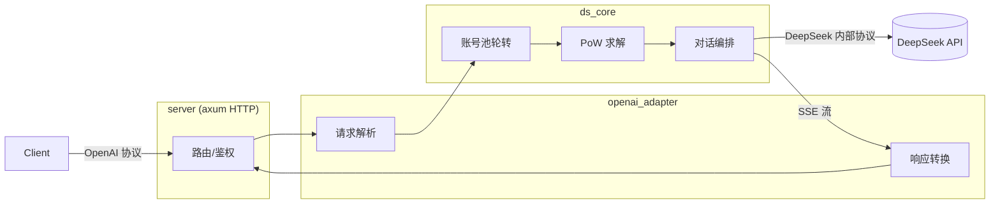

# DS-Free-API

[](LICENSE)


[English](README.en.md)

将免费的 DeepSeek 网页端对话反代并适配转换为标准的 OpenAI API 协议 (目前支持 openai_chat_completions，包括流式返回与工具调用)。

支持 Rust 原生多端高性能，单可执行文件 + 单 TOML 配置文件。

## 快速开始

去 [releases](https://github.com/NIyueeE/ds-free-api/releases) 下载对应平台后解压即可。

```
  .
  ├── ds-free-api          # 可执行文件
  ├── LICENSE
  ├── README.md
  ├── README.en.md
  └── config.example.toml  # 配置示例
```

### 配置

复制 `config.example.toml` 为 `config.toml`，和可执行文件保持在同一个路径下，或者使用 `./ds-free-api -c <config_path>` 指定配置路径。

### 运行

```bash
# 直接运行 (同目录下需要 config.toml)
./ds-free-api

# 指定配置路径
./ds-free-api -c /path/to/config.toml

# 调试模式
RUST_LOG=debug ./ds-free-api
```

这里只展示必填项。一个账号对应一个并发量（但 DeepSeek 好像最多限制二个并发）。

```toml
[server]
host = "127.0.0.1"
port = 5317

# API 访问令牌，留空则不鉴权
# [[server.api_tokens]]
# token = "sk-your-token"
# description = "开发测试"

# 邮箱和手机号二选一或都填，手机号目前好像只支持 +86
[[accounts]]
email = "user1@example.com"
mobile = ""
area_code = ""
password = "pass1"
```

这里分享一个免费的测试账号，不要发敏感信息（虽然程序每次会收尾删除会话，但是可能会遗留）。

```text
rivigol378@tatefarm.com
test12345
```

想要自己多整几个账号并发的话，可以研究一下临时邮箱（有些可能不行），然后加魔法在国际版中多注册几个账号。

推荐临时邮箱网站：[temp-mail.org](https://temp-mail.org/en/10minutemail)

## API 端点

| 方法 | 路径 | 说明 |
|------|------|------|
| GET | `/` | 健康检查 |
| POST | `/v1/chat/completions` | 聊天补全（支持流式与工具调用） |
| GET | `/v1/models` | 模型列表 |
| GET | `/v1/models/{id}` | 模型详情 |

## 模型映射

`config.toml` 中 `model_types`（默认 `["default", "expert"]`）自动映射：

| OpenAI 模型 ID | DeepSeek 类型 |
|----------------|--------------|
| `deepseek-default` | 快速模式 |
| `deepseek-expert` | 专家模式 |

### 能力开关

- **深度思考**：默认已开启。如需显式关闭，请求体中加 `"reasoning_effort": "none"`。
- **智能搜索**：默认关闭。如需开启，请求体中加 `"web_search_options": {"search_context_size": "high"}`。
- **工具调用**：按 OpenAI 标准传入 `tools` 与 `tool_choice` 即可。当模型决定调用工具时，返回的 `finish_reason` 为 `tool_calls`。

## 开发

需要 Rust 1.94.1+（见 `rust-toolchain.toml`）。

```bash
# 一键检查 (check + clippy + fmt + audit + unused deps)
just check

# 运行测试
cargo test

# 运行 HTTP 服务
just serve

# CLI 示例
just ds-core-cli
just openai-adapter-cli

# Python e2e 测试（需要服务已在 5317 端口运行）
just e2e

# 使用 e2e 专属配置启动服务
just e2e-serve
```

简要架构图：



数据管道：

- **请求**: `JSON body` → `normalize` 校验/默认值 → `tools` 提取 → `prompt` ChatML 构建 → `resolver` 模型映射 → `ChatRequest`
- **响应**: `DeepSeek SSE bytes` → `sse_parser` → `state` 补丁状态机 → `converter` 格式转换 → `tool_parser` XML 解析 → `StopStream` 截断 → `OpenAI SSE bytes`

## 许可证

[Apache License 2.0](LICENSE)

DeepSeek 官方 API 非常便宜，请大家多多支持官方服务。

本项目的初心是想体验官方网页端灰度测试的最新模型。

**严禁商用**，避免对官方服务器造成压力，否则风险自担。
