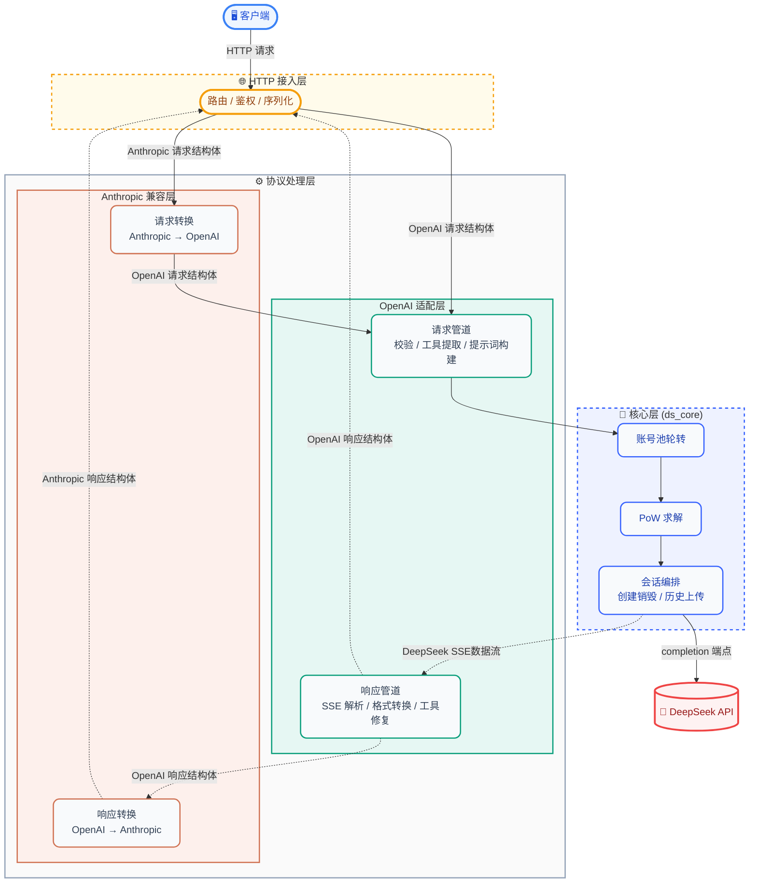
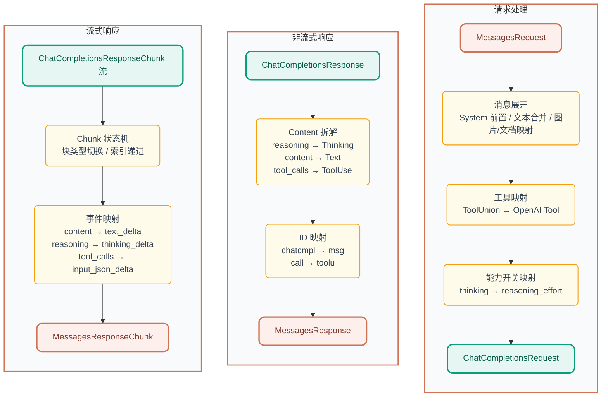

<p align="center">
  
</p>

<h1 align="center">DS-Free-API</h1>

<p align="center">
  <a href="LICENSE"></a>
  
  
  
</p>
<p align="center">
  
  
  
</p>

[English](README.en.md)

将免费的 DeepSeek 网页端对话反代并适配转换为标准的 OpenAI 与 Anthropic 兼容 API 协议（目前支持 chat completions 和 messages，包括流式返回与工具调用）。

## 项目亮点

- **零成本 API 代理**：使用 DeepSeek 免费网页端，无需官方 API Key，即可获得 OpenAI / Anthropic 兼容接口
- **双协议支持**：同时兼容 OpenAI Chat Completions 与 Anthropic Messages API，主流客户端即插即用
- **工具调用就绪**：OpenAI function calling 完整实现，工具解析 + 三层自修复管道（文本修复 → JSON 修复 → 模型兜底），覆盖 10+ 异常格式
- **文件上传就绪**：支持 OpenAI `file` / `image_url` content part 和 Anthropic `image` / `document` content block 的内联 data URL 文件自动上传到 DeepSeek 会话；
  HTTP URL 自动触发搜索模式，模型可直接访问链接内容
- **Web 管理面板**：内置可视化面板，账号池状态、API Key 管理、请求日志、配置热重载，开箱即用
- **模型别名**：支持自定义模型 ID 映射（如 `deepseek-v4-flash` → `deepseek-default`），兼容更多客户端
- **Rust 实现**：单可执行文件 + 单 TOML 配置，跨平台原生高性能（Web 面板编译时嵌入，开箱即用）
- **多账号池**：空闲最久优先轮转（DashMap 无锁读），支持水平扩展并发

## 快速开始

去 [releases](https://github.com/NIyueeE/ds-free-api/releases) 下载对应平台后解压即可。

```
  .
  ├── ds-free-api          # 可执行文件
  ├── LICENSE
  ├── README.md
  ├── README.en.md
  └── config.example.toml  # 配置示例
```

### 配置

复制 `config.example.toml` 为 `config.toml`，和可执行文件保持在同一个路径下，或者使用 `./ds-free-api -c <config_path>`  指定配置路径。

### 运行

```bash
# 直接运行 (同目录下需要 config.toml)
./ds-free-api

# 指定配置路径
./ds-free-api -c /path/to/config.toml

# 调试模式
RUST_LOG=debug ./ds-free-api
```

这里只展示必填项。一个账号对应一个并发量。

> **并发说明**：DeepSeek 免费 API 对每个 session 有速率限制（`Messages too frequent. Try again later.`），单账号在频繁请求时会触发限流。本项目内置以下机制保障稳定：
> - **限流自动检测**：监听 SSE `hint` 事件中的 `rate_limit` 信号，快速识别限流
> - **指数退避重试**：检测到限流后自动重试，间隔为 1s→2s→4s→8s→16s，最多 6 次
> - **`stop_stream` 智能触发**：仅在客户端主动断连时调用，正常完成时跳过，避免请求冲突
>
> **推荐并行数 = 账号数 ÷ 2**。实测 4 账号 + 2 并发可 100% 通过全部压测场景。单账号 + 单并发在上述重试机制下也可跑通。

```toml
[server]
host = "127.0.0.1"  # 对公网开放请改为 0.0.0.0
port = 5317

# CORS 允许的 Origin 列表（默认 ["http://localhost:5317"]）
# cors_origins = ["http://localhost:5317"]

# API Key 和管理密码通过 Web 管理面板配置（http://127.0.0.1:5317/admin）
# 首次访问时将引导设置管理密码，之后可在面板中创建/管理 API Key

# 邮箱和手机号二选一或都填，手机号目前好像只支持 +86
[[accounts]]
email = "user1@example.com"
mobile = ""
area_code = ""
password = "pass1"
```

> **工具调用标签幻觉**：内置模糊匹配（全角 `｜`↔`|`、`▁`↔`_`），自动覆盖大多数字符级变体。如果模型输出格式完全不同的回退标签导致解析失败，可在 `config.toml` 的 `[deepseek]` 下追加：
> ```toml
> [deepseek]
> tool_call.extra_starts = ["<|tool_call_begin|>", "<tool_calls>", "<tool_call>"]
> tool_call.extra_ends = ["<|tool_call_end|>", "</tool_calls>", "</tool_call>"]
> ```

这里分享几个免费的测试账号，不要发敏感信息（虽然程序每次会收尾删除会话，但是可能会遗留）。密码统一为 `test12345`。

```text
idyllic4202@wplacetools.com
espialeilani+grace@gmail.com
ar.r.o.g.anc.e.p.c.hz.xp@gmail.com
theobald2798+gladden@gmail.com
vj.zh.z.h.d.b.b.d.udhj.db@gmail.com
```

想要自己多整几个账号并发的话，可以研究一下临时邮箱（有些可能不行），然后加魔法在国际版中多注册几个账号。

推荐临时邮箱网站：[tempmail.la](https://tempmail.la/) (有些后缀可能不行, 建议多尝试几次)

## API 端点

### 公开端点

| 方法 | 路径                        | 说明                                         |
| ---- | --------------------------- | -------------------------------------------- |
| GET  | `/`                         | 健康检查                                     |
| GET  | `/health`                   | 健康检查（别名）                             |
| POST | `/v1/chat/completions`      | 聊天补全（支持流式与工具调用）               |
| GET  | `/v1/models`                | 模型列表                                     |
| GET  | `/v1/models/{id}`           | 模型详情                                     |
| POST | `/anthropic/v1/messages`    | Anthropic Messages API（支持流式与工具调用） |
| GET  | `/anthropic/v1/models`      | 模型列表（Anthropic 格式）                   |
| GET  | `/anthropic/v1/models/{id}` | 模型详情（Anthropic 格式）                   |

### 管理端点（需 JWT 认证）

| 方法   | 路径                              | 说明                     |
| ------ | --------------------------------- | ------------------------ |
| POST   | `/admin/api/setup`                | 首次设置管理密码         |
| POST   | `/admin/api/login`                | 管理员登录               |
| GET    | `/admin/api/status`               | 账号池状态               |
| GET    | `/admin/api/stats`                | 请求统计                 |
| GET    | `/admin/api/models`               | 模型列表                 |
| GET    | `/admin/api/config`               | 当前配置（脱敏）         |
| GET    | `/admin/api/keys`                 | 列出 API Key（脱敏）     |
| POST   | `/admin/api/keys`                 | 创建 API Key             |
| DELETE | `/admin/api/keys/{key}`           | 删除 API Key             |
| POST   | `/admin/api/accounts`             | 动态添加账号             |
| DELETE | `/admin/api/accounts/{id}`        | 动态移除账号             |
| POST   | `/admin/api/accounts/{id}/relogin`| 手动重新登录账号         |
| POST   | `/admin/api/reload`               | 热重载 config.toml 账号  |
| GET    | `/admin/api/logs`                 | 请求日志                 |
| GET    | `/admin/api/runtime-logs`         | 运行时日志               |

## 模型映射

`config.toml` 中 `model_types`（默认 `["default", "expert"]`）自动映射：

| OpenAI 模型 ID     | DeepSeek 类型 |
| ------------------ | ------------- |
| `deepseek-default` | 快速模式      |
| `deepseek-expert`  | 专家模式      |

默认别名（可通过 `[deepseek.model_aliases]` 自定义）：

| 别名模型 ID          | 映射到           |
| -------------------- | ---------------- |
| `deepseek-v4-flash`  | `deepseek-default`|
| `deepseek-v4-pro`    | `deepseek-expert` |

Anthropic 兼容层使用相同的模型 ID，通过 `/anthropic/v1/messages` 调用。

### 能力开关

- **深度思考**：默认已开启。如需显式关闭，请求体中加 `"reasoning_effort": "none"`。
- **智能搜索**：默认已开启（DeepSeek 后端在搜索模式下会注入更强的系统提示词，提升工具调用遵循度）。如需显式关闭，请求体中加 `"web_search_options": {"search_context_size": "none"}`。
- **文件上传**：支持内联文件（data URL）自动上传到 DeepSeek 会话，以及 HTTP URL 自动触发搜索模式：

  **OpenAI 端：**
  ```json
  {"type": "file", "file": {"file_data": "data:text/plain;base64,...", "filename": "doc.txt"}}
  {"type": "image_url", "image_url": {"url": "data:image/png;base64,..."}}
  {"type": "image_url", "image_url": {"url": "https://example.com/img.jpg"}}  {" "}
  ```

  **Anthropic 端：**
  ```json
  {"type": "image", "source": {"type": "base64", "media_type": "image/png", "data": "..."}}
  {"type": "document", "source": {"type": "base64", "media_type": "text/plain", "data": "..."}}
  {"type": "image", "source": {"type": "url", "url": "https://example.com/img.jpg"}}
  ```

## Web 管理面板

启动服务后访问 `http://127.0.0.1:5317/admin` 即可进入管理面板：

- **概览**：请求统计、账号池状态一览
- **账号池**：查看/添加/移除账号，手动重新登录 Error 状态账号
- **API Keys**：创建/删除 API Key，脱敏展示
- **模型**：可用模型列表与详情
- **配置**：当前运行配置（脱敏）
- **日志**：最近请求日志与运行时日志

首次访问时引导设置管理密码（bcrypt 哈希存储），登录后签发 JWT（24h 有效），支持密码重置时吊销旧 Token。

## 安全

- **管理面板**：JWT 认证 + bcrypt 密码哈希 + 登录失败率限制（5 次失败锁定 5 分钟）
- **API 访问**：通过管理面板创建的 API Key 鉴权（HashSet O(1) 查找）
- **CORS**：可配置允许的 Origin 列表，默认仅 `http://localhost:5317`
- **敏感信息**：账号 ID 在响应头中脱敏，请求体不记录日志，持久化文件权限 0600

## 开发

需要 Rust 1.95.0+（见 `rust-toolchain.toml`）和 Node.js 18+（Web 面板开发）。

### 从源码构建

```bash
# 1. 构建 Web 前端（编译时嵌入二进制，release 需要先构建）
cd web && npm install && npm run build && cd ..

# 2. 构建 Release 二进制（Web 面板已通过 rust-embed 嵌入）
cargo build --release

# 3. 运行
./target/release/ds-free-api
```

> **开发模式**：如果 `web/dist/` 目录存在，服务端会优先从文件系统读取（支持前端热更新）；
> 不存在时回退到编译时嵌入的资源。开发时可同时运行 `npm run dev`（Vite HMR）和 `just serve`。

### Docker 部署

```bash
# 1. 交叉编译 Rust 二进制（Mac ARM → x86 Linux，~1.5 分钟）
cargo zigbuild --release --target x86_64-unknown-linux-gnu

# 2. 构建前端
cd web && npm install && npm run build && cd ..

# 3. 打包 Docker 镜像（~1 秒）
docker build --platform linux/amd64 -t ds-free-api .

# 4. 导出并传输到服务器
docker save ds-free-api | gzip > ds-free-api.tar.gz
scp ds-free-api.tar.gz user@server:/tmp/

# 5. 服务器加载并启动
ssh user@server
docker load < /tmp/ds-free-api.tar.gz
docker compose up -d    # 数据卷自动保留
```

> 服务器原生 x86 环境可直接在服务器上运行上述命令（去掉 `--platform` 参数），速度更快。
> Docker 镜像仅包含预编译二进制 + 前端资源，无需容器内编译。

> **Prompt 注入策略**：本项目通过将 OpenAI 消息格式转换为 DeepSeek 原生标签（`<｜User｜>` / `<｜Assistant｜>` / `<｜tool▁outputs▁begin｜>` 等）并嵌入 `<think>` 块来引导模型的思考以注入工具定义和格式指令。详细实现思路与调研过程见 [`docs/deepseek-prompt-injection.md`](docs/deepseek-prompt-injection.md)。如果你有更好的发现或改进思路，欢迎提 issue 或 PR。

```bash
# 一键检查 (check + clippy + fmt + audit + unused deps)
just check

# 运行测试
cargo test

# 运行 HTTP 服务
just serve

# 统一协议调试 CLI（内置对话/比较/并发等模式）
just adapter-cli

# e2e 测试（需要服务已在 5317 端口运行，场景正交）
just e2e-basic    # 基础功能（双端点）
just e2e-repair   # 工具调用修复专项
just e2e-stress   # 多迭代压测（全部场景）

# 使用 e2e 专属配置启动服务
just e2e-serve
```

### 简要架构图：



### 数据管道：

#### OpenAI (chat_completions) 处理管道:


#### Anthropic (messages) 处理管道:



### e2e 测试

`py-e2e-tests/` 是基于 JSON 场景驱动的端到端测试框架，无需 pytest 依赖。分为三层：

| 层级       | 命令              | 覆盖范围                                              |
| ---------- | ----------------- | ----------------------------------------------------- |
| **Basic**  | `just e2e-basic`  | 基础功能场景（双端点 OpenAI + Anthropic），安全并发数 |
| **Repair** | `just e2e-repair` | 工具调用异常格式修复专项（OpenAI 单端点），安全并发数 |
| **Stress** | `just e2e-stress` | 全部场景 × 3 次迭代，安全并发数 + 1 并发              |

场景文件在 `scenarios/` 中按类型独立存放：

```
py-e2e-tests/
├── scenarios/
│   ├── basic/
│   │   ├── openai/         # 10 个基础场景（对话、推理、流式、工具调用、文件上传、图片上传、HTTP链接等）
│   │   └── anthropic/      # 6 个基础场景（对话、推理、工具调用、文档上传、图片上传、HTTP链接）
│   └── repair/             # 10 个工具损坏格式场景
├── runner.py               # 单次运行入口
├── stress_runner.py        # 多迭代压测入口
└── config.toml             # e2e 专用服务端配置
```

每个场景为独立 JSON 文件，包含请求参数和校验规则：

```json
{
  "name": "场景名称",
  "endpoint": "openai|anthropic",
  "category": "basic|repair",
  "models": ["deepseek-default", "deepseek-expert"],
  "messages": [{"role": "user", "content": "..."}],
  "tools": [...],
  "tool_choice": "auto",
  "request": {"stream": false},
  "checks": {
    "has_tool_calls": true,
    "tool_names": ["get_weather"],
    "finish_reason": "tool_calls",
    "no_error": true
  }
}
```

### e2e CLI 参数

**`just e2e-basic` 和 `just e2e-repair`（单次运行）：**

| 参数 | 作用 |
|------|------|
| `scenario_dir` | 场景目录，如 `scenarios/basic` 或 `scenarios/repair` |
| `--endpoint` | 端点过滤：`openai` / `anthropic` |
| `--model` | 模型过滤：`deepseek-default` / `deepseek-expert` |
| `--filter` | 场景名称关键字过滤（多个用空格分隔，如 `--filter 文件 图片`）|
| `--parallel` | 并行数，默认 `账号数 ÷ 2` |
| `--show-output` | 显示模型回复摘要、工具调用、结束原因 |
| `--report` | 输出 JSON 报告路径 |

**`just e2e-stress`（压测）：**

| 参数 | 作用 |
|------|------|
| `--iterations` | 每场景迭代次数，默认 3 |
| `--models` | 模型列表过滤 |
| `--filter` | 场景名称关键字过滤（多个用空格分隔）|
| `--parallel` | 并行数，默认 `账号数 ÷ 2 + 1` |
| `--show-output` | 显示模型输出 |
| `--report` | 输出 JSON 报告路径 |

使用示例：

```bash
# 快速验证新加的文件上传场景
just e2e-basic --filter 文件 图片 --show-output

# 仅查看 OpenAI 端点的 expert 模型
just e2e-basic --endpoint openai --model deepseek-expert

# 串行调试
just e2e-basic --endpoint openai --parallel 1 --show-output

# 压测：工具调用修复场景 × 5 次迭代
just e2e-stress --filter 修复 --iterations 5

# 输出 JSON 报告
just e2e-basic --report result.json
```

**可选**: 建议通过这个e2e测试后再提PR

## 许可证

[Apache License 2.0](LICENSE)

[DeepSeek 官方 API](https://platform.deepseek.com/top_up) 非常便宜，请大家多多支持官方服务。

本项目的初心是想体验官方网页端灰度测试的最新模型。

**严禁商用**，避免对官方服务器造成压力，否则风险自担。

~~还有deepseek依旧是国一模!!!~~
