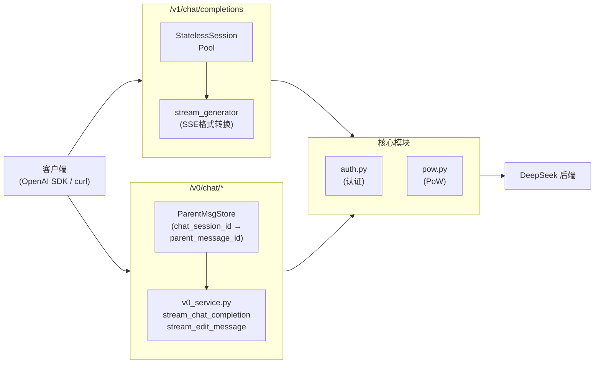

# DeepSeek Web API

[](LICENSE)


[English](./README.md) | [中文](./README.中文.md)

受 [deepseek2api](https://github.com/iidamie/deepseek2api) 启发。DeepSeek 网页端 API 的透明代理，提供自动认证和 PoW 计算。

## 特性

- **自动认证**: 服务端管理账号凭据，客户端无需认证（令牌在首次API调用时获取）
- **PoW (工作量证明)**: 自动解决 PoW 挑战
- **SSE 流式响应**: 透传 DeepSeek 的 SSE 响应
- **OpenAI 兼容 API**: `/v1/chat/completions` 端点，完整工具调用支持

## 快速开始

```bash
# 配置账号
cp config.toml.example config.toml
# 编辑 config.toml 填入 DeepSeek 账户密码

# 运行服务
uv run python main.py
```

**注意**：仅支持单用户模式，以防止对 DeepSeek 服务器造成过多负载。~不会实现多用户请求。~

## 配置

运行前需要配置 `config.toml`：

```toml
[server]
host = "127.0.0.1"                  # 建议保持 loopback，仅本机访问
port = 5001
reload = true
api_key = ""                         # 可选，本地代理鉴权 token，保护 /v0 和 /v1
cors_origins = ["*"]                 # 建议改成明确白名单
cors_allow_credentials = false
cors_allow_methods = ["*"]
cors_allow_headers = ["*"]

[account]
email = "your_email@example.com"   # 邮箱登录（优先）
mobile = ""                        # 手机号登录（email 为空时使用）
area_code = "86"                   # 手机号区号，如 "86"
password = "your_password"
token = ""                         # 非必须，系统会自动管理（首次使用后保存）
```

**安全提示**：
- 为兼容旧用法，默认不启用本地 API 鉴权。
- 如果设置了 `[server].api_key` 或环境变量 `DEEPSEEK_WEB_API_KEY`，所有 `/v0/*` 和 `/v1/*` 请求都必须携带 `Authorization: Bearer <token>` 或 `X-API-Key: <token>`。
- `main.py` 现在会读取 `[server].host`、`[server].port`、`[server].reload`。
- CORS 可通过 `[server].cors_*` 配置；为了兼容旧行为，默认仍较宽松，但面向浏览器暴露时应收紧 `cors_origins`。
- 即便如此，仍建议只监听 `127.0.0.1`（`main.py` 默认值）。

## 模型

通过 `/v1/models` 可用的模型：

| 模型 | 说明 |
|------|------|
| `deepseek-web-chat` | 标准对话模型，禁用思考 |
| `deepseek-web-reasoner` | 推理模型，支持思维链 |

**注意**：默认禁用内部搜索功能。

## 使用案例

[AstrBot](https://github.com/AstrBotDevs/AstrBot) 集成示例，流式思考和工具调用正常工作：


## API 端点

| 端点 | 方法 | 说明 |
|------|------|------|
| `/v1/chat/completions` | POST | OpenAI兼容对话接口，支持工具调用 |
| `/v0/chat/completion` | POST | 发送对话，透传 SSE |
| `/v0/chat/create_session` | POST | 创建新会话 |
| `/v0/chat/delete` | POST | 删除会话 |
| `/v0/chat/history_messages` | GET | 获取聊天历史 |
| `/v0/chat/upload_file` | POST | 上传文件 |
| `/v0/chat/fetch_files` | GET | 查询文件状态 |
| `/v0/chat/message` | POST | 编辑消息 |

### 端点详情

#### POST /v1/chat/completions
OpenAI兼容的对话完成接口，完全支持工具调用和流式响应。完全兼容 OpenAI SDK。

**功能**:
- 接受 OpenAI 风格的 `messages` 数组
- 支持 `tool_calls` 和多轮工具对话
- 流式/非流式响应
- 内部使用 `edit_message` API 无状态会话

### 端点详情

#### POST /v0/chat/completion
**外部表现**: 接收 `prompt`、可选 `chat_session_id`，返回 SSE 流。

**内部操作**:
- 无 `chat_session_id` → 通过 `POST /api/v0/chat_session/create` 创建会话，本地存储，返回 `X-Chat-Session-Id` header
- 有 `chat_session_id` → 从本地存储查找 `parent_message_id`，附加到请求
- 添加 `Authorization`、`x-ds-pow-response` headers，转发至 DeepSeek
- 解析 SSE 提取 `response_message_id`，更新本地会话存储

#### POST /v0/chat/create_session
**外部表现**: 接收 `{"agent": "chat"}`，返回 DeepSeek 会话数据。

**内部操作**:
- 转发至 `POST /api/v0/chat_session/create`
- 从响应中提取 `chat_session_id`，存入本地会话映射
- 返回 DeepSeek 响应，并在顶层显式添加 `chat_session_id` 字段

#### POST /v0/chat/delete
**外部表现**: 接收 `{"chat_session_id": "..."}`，返回 DeepSeek 响应。

**内部操作**:
- 从本地会话存储删除会话
- 转发至 `POST /api/v0/chat_session/delete`

#### GET /v0/chat/history_messages
**外部表现**: 查询参数 `chat_session_id`、`offset`、`limit`，返回消息历史。

**内部操作**:
- 添加 `Authorization` header，转发至 `GET /api/v0/chat/history_messages`

#### POST /v0/chat/upload_file
**外部表现**: Multipart 表单，包含 `file` 字段，返回 DeepSeek 响应。

**内部操作**:
- 从表单读取文件，转发至 `POST /api/v0/file/upload_file`

#### GET /v0/chat/fetch_files
**外部表现**: 查询参数 `file_ids`（逗号分隔），返回文件状态。

**内部操作**:
- 添加 `Authorization` header，转发至 `GET /api/v0/file/fetch_files`

详见 [v0_API](./docs/v0_API.md)。

## 实现说明

### OpenAI 适配器 (`/v1/chat/completions`)
通过 `edit_message` API 实现无状态会话：
- 客户端传入完整的 `messages` 数组，适配器将对话历史注入提示词
- 使用 `message_id=1` 的 `edit_message` 固定编辑最新用户消息
- 模型始终认为这是"第一次对话"，避免会话状态累积
- 支持 `deepseek-web-reasoner` 模型的思考内容

**防幻觉机制**：
当模型输出 `[TOOL🛠️]...[/TOOL🛠️]` 时：
1. 适配器提取并解析工具调用 JSON
2. 向客户端发送 `tool_calls` chunk 和 `finish_reason=tool_calls`
3. 发送 `data: [DONE]\n\n` 通知流结束
4. 继续消费 DeepSeek 剩余流（丢弃数据），以正确关闭连接

## TODO

- [x] 简单包装 deepseek_web_chat API
- [x] 实现 openai_chat_completions 协议适配器
- [x] openai适配器的流式工具调用提取
- [ ] 通过 [litellm](https://github.com/BerriAI/litellm) 实现 claude_message 协议适配器（转换OpenAI协议到Claude协议）
- [ ] 实现多用户账户负载均衡，防止 DeepSeek 请求频率限制

## 架构



## 免责声明

DeepSeek 官方 API 非常便宜，请大家多多支持官方服务。

本项目的初心是想体验官方网页端灰度测试的最新模型。

**严禁商用**，避免对官方服务器造成压力，否则风险自担。
